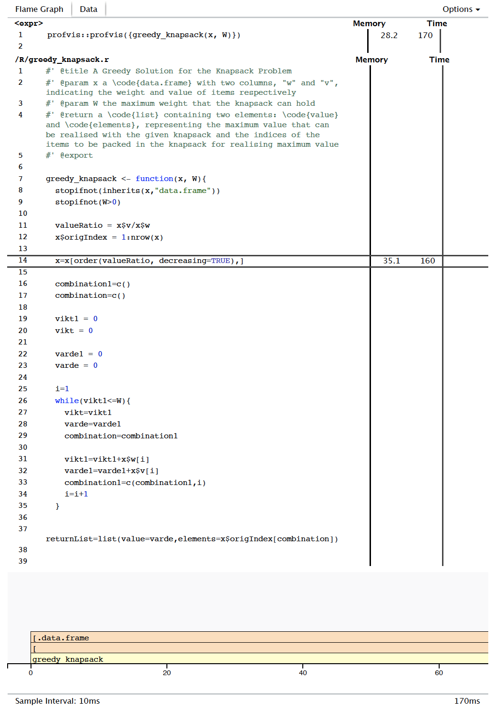
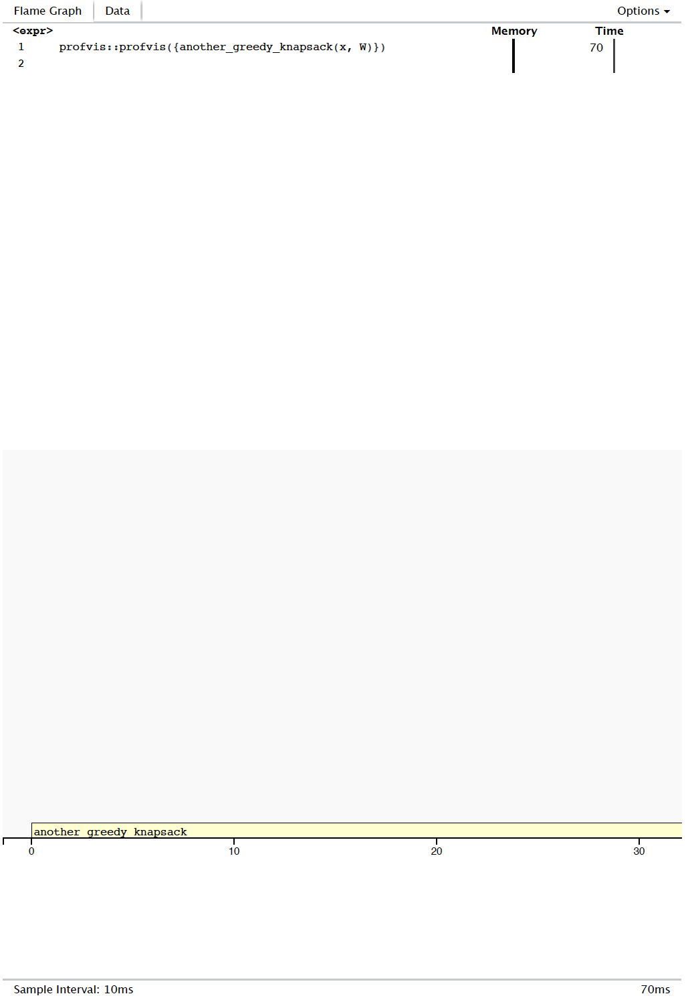

```{r, include = FALSE}
knitr::opts_chunk$set(
  collapse = TRUE,
  comment = "#>"
)
```
# Introduction
The [Knapsack Problem](https://en.wikipedia.org/wiki/Knapsack_problem)  is a well known problem in Computing. This package, called ["knapsack"](https://github.com/rojanka/knapsack), implements four different solutions for this problem: the first two use brute-force methods - of these, the first makes use only of one processor core, whereas the second uses multiple cores via parallel programming techniques - the remaining two solutions apply dynamic programming and greedy approaches respectively. In each of these cases, the solution is implemented as a function (hereafter "package functions"), as described below.

```{r setup, echo = FALSE}
library(knapsack)
```

# Package Function Inputs
All package functions expect the following two input arguments:

1. A _data.frame_ "__x__" with two numeric columns: item weights ("__w__") and item values ("__v__")
1. A _numeric scalar_ "__W__", representing knapsack capacity (the maximum weight it can hold)

Below is an example of a set of suitable arguments.

``` {r}
set.seed(42)
n <- 1000000
x <- data.frame(
  w=sample(1:4000, size = n, replace = TRUE),
  v=runif(n = n, 0, 10000)
)
W <- 3500

print(x[1:8, ])
print(W)
```

# Package Function Outputs
If no errors are encountered, each package function outputs a list containing two elements:

1. __value__: a numeric scalar, which is the maximum value (see note) that can be realised given items and knapsack capacity
2. __elements__: a vector of the indices of items to be included in the knapsack in order to realise the said maximum _value_

__Note__: Brute-force and dynamic programming methods are guaranteed to generate a global maximum value, whereas greedy methods generate a local maximum value that is guaranteed, in the worst case, be half that of the global maximum value. See cited references for more details.

# Package Solutions
## Function implementing a Brute-Force Solution (without Parallelisation)
Given _n_ items to choose from, the __knapsack_brute_force__ function goes over each of the _2^n_ possible ways of filling the knapsack, whilst keeping track of the hitherto most optimal solution, and returns outputs as described above. Our implementation, however, does not allow for _n_ to be any larger than 31; this is because of our reliance on the _intToBits_ function, which requires arguments to be integers, which in turn can be no larger than 2^31 - 1 (2,147,483,647) in _R_.

``` {r}
knapsack_brute_force(x[1:8, ], 3500)
```

Given its _O(2^n)_ time complexity, this function does not perform optimally in terms of time taken for execution. For n = 16 items and knapsack capacity W = 2000, we can see below the time taken for function execution.

``` {r}
system.time(knapsack_brute_force(x[1:16, ], 2000))
```

## Function implenting a Parallelised version of the Brute-Force Solution
The _knapsack_brute_force_ function described above also takes on an optional argument _'parallel'_ whose value is set to _FALSE_ by default. Forcing it to _TRUE_ however invokes the parallelised version of the above mentioned brute-force solution. If the machine running the function has suitable computing hardware and if there are a sufficiently large number of objects to choose from, then despite the function still having time complexity of order _O(2^n)_, parallelisation will deliver significantly faster execution.

``` {r, eval = FALSE}
system.time(knapsack_brute_force(x[1:21, ], 2000))
system.time(knapsack_brute_force(x[1:21, ], 2000, parallel = TRUE))
```

Note that the above two lines of code cannot be run as part of this vignette, as current CRAN principles do not allow for package vignettes to use more than two processor cores for computation. Our implementation, on the other hand, makes use of as many processor cores as are available. The above lines of code are being shown in this vignette merely as examples that can, in general, be run. To give you a sense of the performance gain involved, below are images of runs of the parallelised and non-parallelised versions of the brute force based algorithm on a device whose specs are as shown below.

{width=50%}

{width=25%}

## Function implementing a Dynamic Programming based Solution
The __knapsack_dynamic__ function solves the knapsack problem using dynamic programming, as outlined in several texts (see references). 

``` {r}
knapsack_dynamic(x[1:8, ], 3500)
```

This function has time complexity of order _O(n.W)_, where _n_ is the number of items that can potentially be included in the knapsack and _W_ is the knapsack capacity. One can therefore expect faster execution as compared to a single processor Brute Force implementation. For n = 500 items and knapsack capacity W = 2000, we can see below the time taken for function execution.

``` {r}
system.time(knapsack_dynamic(x[1:500, ], 2000))
```

## Function implementing a Greedy Approach
The function __greedy_knapsack__ uses a [greedy approach](https://en.wikipedia.org/wiki/Greedy_algorithm) which, as cited in the literature we reference below, consists of sorting available items in descending order of their value per unit weight and including in the knapsack as many of the top-most items as it can possibly hold. Although this approach may not provide the most optimal solution to the problem, its solution is guaranteed (as also cited in the literature referenced) to generate knapsack value that is, at worst, half of the maximum value that can possibly be generated with the given objects and knapsack capacity.

``` {r}
greedy_knapsack(x[1:8, ], 3500)
```

This function has time complexity of order _O(n.log(n))_, where _n_ is the number of items that can potentially be included in the knapsack. This follows from the fact that the complexity of the sorting operation overwhelms the sum of complexities of all the other operations in the procedure. One can therefore expect faster execution even in comparison to Dynamic Programming based implementations. For n = 1,000,000 items and knapsack capacity W = 2000, we can see below the time taken for function execution.

``` {r}
system.time(greedy_knapsack(x[1:1000000, ], 2000))
```

### Profiling and optimising the Greedy Approach Function
Profiling using the [profvis](https://rstudio.github.io/profvis/) package helped optimise our __greedy_knapsack__ function. Profiles revealed a bottleneck wherein the input data.frame of knapsack objects was being sorted. Thereafter, we created another version of the greedy function which used sorted row indices in place of the sorted data.frame. This brought in over 2x performance gain.

``` {r}
system.time(another_greedy_knapsack(x[1:1000000, ], 2000))
```

{length=50%, width=50%}

{length=50%, width=50%}

# Conclusion
Among the multiple solutions we have made available through the ["knapsack"](https://github.com/rojanka/knapsack) package, the brute-force based function, __"knapsack_brute_force"__ is the slowest. Parallelisation improves speed of execution, but the inherent high time complexity of the algorithm, makes it less efficient than the __"knapsack_dynamic"__ function. Dynamic programming brings down algorithm time complexity, but can still take a large amount of time for execution if there a very large number of objects to choose from. In such a case, the function __"another_greedy_knapsack"__ will deliver best performance in terms of speed of execution, but at the cost of some accuracy.

# References
1. [Knapsack Problem - Wikipedia](https://en.wikipedia.org/wiki/Knapsack_problem)
1. [Dynamic Programming Solution - T. Cormen, C. Leiserson, R. Rivest, and C. Stein. (2009) - p317-8](http://mitp-content-server.mit.edu:18180/books/content/sectbyfn?collid=books_pres_0&id=8030&fn=Intro_to_Algo_Selected_Solutions.pdf)
1. [Approximation Algorithms I - MIT OpenCourseWare](https://ocw.mit.edu/courses/sloan-school-of-management/15-083j-integer-programming-and-combinatorial-optimization-fall-2009/lecture-notes/MIT15_083JF09_lec21.pdf)
1. [Greedy Algorithms - Wikipedia](https://en.wikipedia.org/wiki/Greedy_algorithm)
1. [Greedy Algorithms - MIT OpenCourseWare](https://ocw.mit.edu/courses/civil-and-environmental-engineering/1-204-computer-algorithms-in-systems-engineering-spring-2010/lecture-notes/MIT1_204S10_lec10.pdf)